```mermaid
graph TD
    %% Kullanıcı Katmanı
    subgraph User_Layer["User Layer"]
        User[User]
        Search[Search]
        Mail[Mail]
        Drive[Drive]
        Video[Video]
        Map[Map]
        Docs[Docs]
    end

    %% Servis Platformu
    subgraph Service_Platform["Service Platform"]
        Auth[Auth]
        Payment[Payment]
        Ads[Ads]
        AI_Recommendation[AI Recommendation]
    end

    %% Veri Katmanı
    subgraph Data_Layer["Data Layer"]
        National_Web_Index[National Web Index]
        Gov_Data[Government Data Pool]
        Media_Data[Media Data Pool]
        Enterprise_Data[Enterprise Data Layer]
    end

    %% AI ve Analitik Katmanı
    subgraph AI_Analytics_Layer["AI & Analytics Layer"]
        LLM_Feeding[LLM Feeding]
        NLP_Module[NLP]
        Recommendation_Engine[Recommendation Engine]
        BigData_Analytics[Big Data Analytics]
    end

    %% Altyapı Katmanı
    subgraph Infrastructure_Layer["Infrastructure Layer"]
        Local_DC[Local Data Centers]
        Hybrid_Cloud[Hybrid Cloud]
        Edge_Node[Edge Node]
    end

    %% Bağlantılar
    User --> Search
    User --> Mail
    User --> Drive
    User --> Video
    User --> Map
    User --> Docs

    Search --> AI_Recommendation
    Mail --> Auth
    Drive --> AI_Recommendation
    Video --> AI_Recommendation
    Docs --> AI_Recommendation

    Auth --> National_Web_Index
    Payment --> Enterprise_Data
    Ads --> Media_Data
    AI_Recommendation --> LLM_Feeding
    AI_Recommendation --> NLP_Module
    AI_Recommendation --> Recommendation_Engine
    AI_Recommendation --> BigData_Analytics

    National_Web_Index --> AI_Analytics_Layer
    Gov_Data --> AI_Analytics_Layer
    Media_Data --> AI_Analytics_Layer
    Enterprise_Data --> AI_Analytics_Layer

    AI_Analytics_Layer --> Local_DC
    AI_Analytics_Layer --> Hybrid_Cloud
    AI_Analytics_Layer --> Edge_Node
```

# 🇹🇷 ATLAS: Türkiye Veri Egemenliği ve Entegre Dijital Ekosistemi


> **"Dijital Dünyanın Yerli Haritası"**

ATLAS; Türkiye'nin dağınık dijital servislerini (Mail, Bulut, Arama, Sosyal Medya) **Tek Oturum Açma (SSO)** teknolojisi ile tek bir çatı altında birleştiren, veri egemenliğini sağlamayı ve ulusal yapay zeka modelleri için veri üretmeyi hedefleyen bütünleşik bir süper platform mimarisidir.

🌐 **Canlı Prototip:** [www.atlasx.com.tr](https://www.atlasx.com.tr)

---

## 🎯 Vizyon ve Amaç

Dijital çağda veri, en az toprak kadar kritik bir egemenlik alanıdır. Türkiye ekonomisinden yılda yaklaşık **5 milyar dolar** değerindeki dijital kaynağın (reklam ve lisans gelirleri) yurt dışına transferini engellemek amacıyla geliştirilmiştir.

**Temel Hedefler:**
1. **🛡️ Veri Egemenliği:** Vatandaş ve kamu verisinin yerli veri merkezlerinde (Turkcell vb.) tutulması.
2. **🔗 Entegre Deneyim:** Google/Microsoft ekosistemlerine alışkın kullanıcılar için **kesintisiz ve tek kimlikli (SSO)** deneyim.
3. **🧠 Yapay Zeka Yakıtı:** Yerli LLM (Büyük Dil Modelleri) eğitimi için gereken Türkçe veri setlerinin oluşturulması.

---

## 🏗️ Mimari ve Teknoloji Yığını

ATLAS, monolitik yapılar yerine ölçeklenebilir, konteyner tabanlı **Mikroservis Mimarisi** üzerine inşa edilmiştir.

| Alan | Teknoloji | Açıklama |
| :--- | :--- | :--- |
| **Backend** | - | Yüksek performanslı servisler ve AI işlemceleri. |
| **Frontend** | Next.js, React | Hızlı ve SEO dostu kullanıcı arayüzleri. |
| **Auth (SSO)** | - | OAuth2 ve OIDC tabanlı merkezi kimlik yönetimi. |
| **Veritabanı** | - | İlişkisel ve zaman serisi veri yönetimi. |
| **Depolama** | - | Dağıtık nesne depolama (Object Storage). |
| **Arama** | - | Ölçeklenebilir tam metin arama motoru. |
| **DevOps** | - | Konteyner orkestrasyonu ve otomatik ölçekleme. |
| **Altyapı** | Hibrit Bulut / Edge | Turkcell Veri Merkezleri ve Uç Bilişim noktaları. |

### Sistem Akış Şeması




---

## 🚀 Özellikler ve Modüller

Proje, MVP (Minimum Viable Product) aşamasında aşağıdaki modülleri içermektedir:

* 🔐 **Atlas ID:** Tek hesapla tüm ekosisteme giriş (SSO).
* 📧 **Atlas Mail:** Yerli, güvenli ve şifreli e-posta servisi.
* ☁️ **Atlas Drive:** KVKK uyumlu, Türkiye'de barındırılan bulut depolama.
* 🔍 **Atlas Search:** Türkçe morfolojisine uygun optimize edilmiş arama motoru.
* 💬 **Atlas Pulse:** Mikro-blogging ve yerli sosyal medya akışı.
* 🤖 **Atlas AI:** Kullanıcı verilerini (anonim) işleyerek akıllı öneriler sunan yapay zeka katmanı.

---

## 🛠️ Kurulum (Geliştirici Modu)

Projeyi yerel ortamınızda incelemek için.

```bash
# Repoyu klonlayın
git clone https://github.com/kullaniciadi/ATLAS-Prototip.git

# Proje dizinine girin
gerekli paketleri kurun ve npm run dev komutunu çalıştırın (npm ve npm install)

```

çalıştırıldıktan sonra sonra:

* **Frontend Arayüz:** [http://localhost:3000](http://localhost:3000)


---

## 📞 İletişim & Künye

Bu proje Turkcell Yarının Teknoloji Liderleri yarışması için geliştirilmiştir.

* **Web:** [www.atlasx.com.tr](http://www.atlasx.com.tr)

